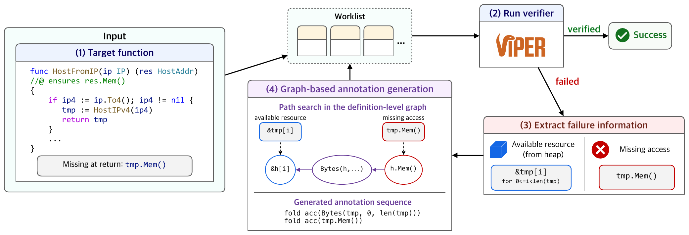

# FUSION

FUSION synthesizes missing fold/unfold annotations for Viper-based verification.
Given a verification failure, it generates candidate annotation sequences from failure-local state and a predicate dependency graph, then repeatedly re-verifies until success or until the attempt budget is exhausted.

FUSION is implemented as a Gobra-based tool.

We support two modes:

- `ours`: FUSION in the paper. Graph-based fold/unfold annotation synthesis.
- `baseline`: ENUM in the paper. Enumerative search for fold/unfold annotation synthesis.

## Workflow Overview



## Recommended: Running via Docker

We recommend running FUSION via Docker.
The Docker image already builds FUSION and Gobra and packages the repository in the expected runtime layout.

### Build the image

From the repository root:

```bash
docker build -t fusion -f dockerfile/Dockerfile .
```

### Start the container

```bash
docker run -it fusion
```

Inside the container, the repository is located at:

```bash
/workspace/fusion
```

The Docker image already builds FUSION and Gobra during image build, so no additional build step is needed inside the container.
The image also includes the sanitized experiment archives needed by `script/reproduce.py`.

## Reproducing the Paper Results

This repository includes pre-sanitized experiment logs and a reproduction script for the paper's main summary numbers.
Because the raw experiment directories are large, the repository keeps only the sanitized log files needed for these statistics.

From the repository root:

```bash
cd /workspace/fusion
python script/reproduce.py
```

The script first checks that the sanitized experiment directories needed for reproduction are present.
If only the corresponding `.tar.gz` archives are present, it automatically extracts them and prints an extraction message.

### Expected Output

The exact absolute paths in the `Input Detection` section may differ depending on your workspace root, but the following reproduced values should match:

```text
=== Section 1 Statistics ===
Gobra-annotated functions/methods: 361
Total Gobra annotation lines: 5573
Total Gobra annotation lines excluding function-level contract lines: 3804
Total fold/unfold lines: 994
Total loop invariant lines: 220
Functions with at least one fold/unfold: 199
Functions with at least one loop invariant: 16
Share of fold/unfold lines among total Gobra annotation lines: 17.836%
Share of loop invariant lines among total Gobra annotation lines: 3.948%
Share of Gobra-annotated functions/methods that contain at least one fold/unfold: 55.125%
Fold/unfold lines divided by loop invariant lines: 4.518x

=== Section 4 Table 1 Benchmark Features ===
VerifiedSCION size (.go + .gobra): 135.112 kLoC
FOLDBENCH targets / files / packages: 149 / 19 / 10
Average fold/unfold lines per FOLDBENCH target: 4.282

=== Section 4 Statistics ===
Enum solved within 20 minutes: 70/149 (47.0%)
Fusion solved within 20 minutes: 91/149 (61.1%)
```

These numbers are computed from:

- the sanitized FUSION (`ours`) and ENUM (`baseline`) experiment logs for the 20-minute Figure 5 evaluation
- the checked-in `benchmark/verifiedscion` tree

### Running the Full Experiments

To run the full VerifiedSCION benchmark instead of replaying the sanitized logs, use:

```bash
cd /workspace/fusion
python src/fusion_gobra.py \
  --all-foldbench \
  --exp-list benchmark/verifiedscion_exp_list.txt \
  --mode ours \
  --max-attempts 20 \
  --kill-z3-on-task-start true
```

Parameters:

- `--all-foldbench`: run all FOLDBENCH targets from the benchmark list
- `--exp-list benchmark/verifiedscion_exp_list.txt`: use the VerifiedSCION benchmark configuration
- `--mode ours|baseline`: choose ours (FUSION) or baseline (ENUM)
- `--max-attempts 20`: use the attempt budget used in the paper
- `--kill-z3-on-task-start true`: proactively clear stale Z3 processes between tasks

Each run creates a fresh session directory under `output/experiments/`.

With the default settings shown above, a full run typically takes about `1-2 days`, depending on the machine and background load.

## Quick Smoke Run

Before running the full benchmark, you can check that the end-to-end synthesis pipeline works on a small VerifiedSCION smoke subset.

Inside the Docker container:

```bash
cd /workspace/fusion
python src/fusion_gobra.py \
  --smoke-run
```

By default, this uses:

- `benchmark/smoke_run_exp_list.txt`
- `--mode ours`
- at most `3` FOLDBENCH functions

You can also choose a mode explicitly:

```bash
python src/fusion_gobra.py \
  --smoke-run \
  --mode baseline
```

Or restrict the smoke run to a specific file and a custom function cap:

```bash
python src/fusion_gobra.py \
  --smoke-run \
  --smoke-file benchmark/verifiedscion/pkg/addr/host.go \
  --smoke-max-functions 3 \
  --mode ours
```

This run should finish quickly and is the simplest end-to-end way to see FUSION in action.
With the default smoke settings above, it typically finishes in about `5 minutes`, depending on the machine.

## Running Synthesis for a Single Function

FUSION provides a single-target mode for Gobra inputs.
This mode is driven by:

- a Gobra command template JSON passed via `--gobra-config`
- a concrete function target passed via `--target /abs/path/file.go@line`

### Example command

The repository includes a tiny Gobra example config at:

- [`src/config/example.fusion.config.json`](src/config/example.fusion.config.json)

and a small Gobra example program at:

- [`src/example/example.go`](src/example/example.go)

The function `foo` starts at line `11`.

Inside the Docker container:

```bash
cd /workspace/fusion
python src/fusion_gobra.py \
  --gobra-config src/config/example.fusion.config.json \
  --target /workspace/fusion/src/example/example.go@11 \
  --mode ours
```

On success, `target` mode preserves the synthesized final file state in the target file.
All intermediate logs and outputs are still written under:

```text
output/experiments/session_*/
```

### Config file format

A config file is a JSON object with a Gobra command template.
Example:

```json
{
  "name": "example-no-folds",
  "command": "java -jar gobra/target/scala-2.13/gobra.jar -i __TARGET__"
}
```

Rules:

- `command` is required
- `__TARGET__` must appear exactly once
- `__TARGET__` must be the first input immediately after `-i`
- the rest of the Gobra command can be customized as needed for the target project

## Parameters for Single-Target Use

The following parameters are the main ones for single-target tool use.

### Input selection

- `--gobra-config PATH`
  - selects single-target config mode
  - used for arbitrary Gobra targets

### Target scope

- `--target /abs/path/file.go@line`
  - run a single target function
  - required for `--gobra-config`

### Synthesis mode

- `--mode ours` (default)
  - graph-based synthesis mode
- `--mode baseline`
  - local 1-step enumerative baseline

### Attempt budget

- `--max-attempts N`
  - maximum verification attempts per function
  - default: `20`

## Local Execution Guide

If you prefer not to use Docker, you can run FUSION locally.

### Required tools

The current setup assumes the following tools are available:

- Java 17
- `sbt`
- Python 3
- `z3`
- `.NET` + `Boogie`

The Dockerfile is the most reliable reference environment.

### Build Gobra locally

From the repository root:

```bash
cd gobra
sbt compile
sbt assembly
cd ..
```

### Run the example locally

```bash
cd /path/to/fusion
python src/fusion_gobra.py \
  --gobra-config src/config/example.fusion.config.json \
  --target /path/to/fusion/src/example/example.go@11 \
  --mode ours
```

If your machine suffers from lingering Z3 processes, you may want to enable:

```bash
--kill-z3-on-task-start true
```

## Output Structure

Each run creates a new session directory under:

```text
output/experiments/session_*/
```

Typical outputs include:

- `run.log`: high-level progress log
- `session_config.json`: session-wide configuration
- per-target directories containing:
  - verification logs
  - tryFold state/graph/path JSON files
  - source snapshots for each attempt
  - summary JSON files

## Notes on the Included Benchmarks and Tool Base

FUSION is based on the following upstream revisions:

- VerifiedSCION commit `c0b70a6`
  - <https://github.com/viperproject/VerifiedSCION/tree/c0b70a6>
- Gobra commit `9a386be`
  - <https://github.com/viperproject/gobra/tree/9a386be>

The current repository contains the FUSION-specific extensions on top of those bases.
